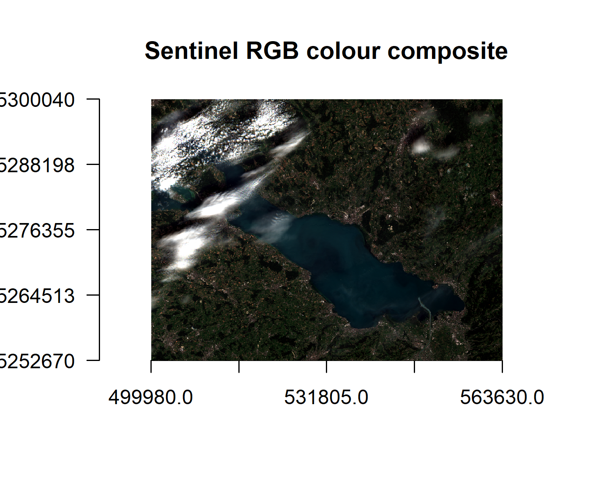
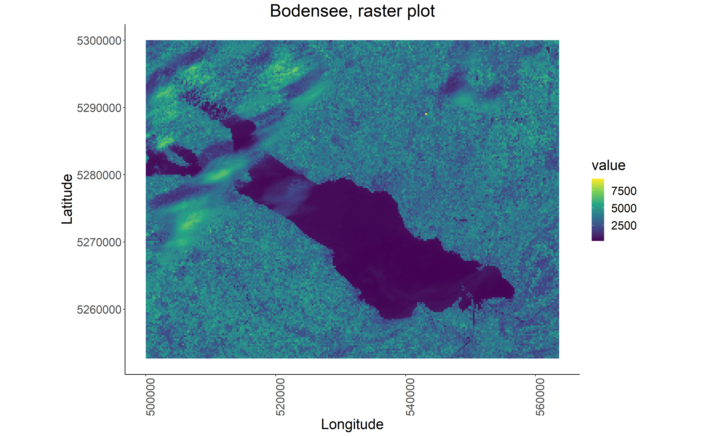
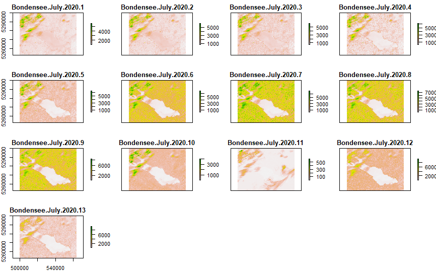
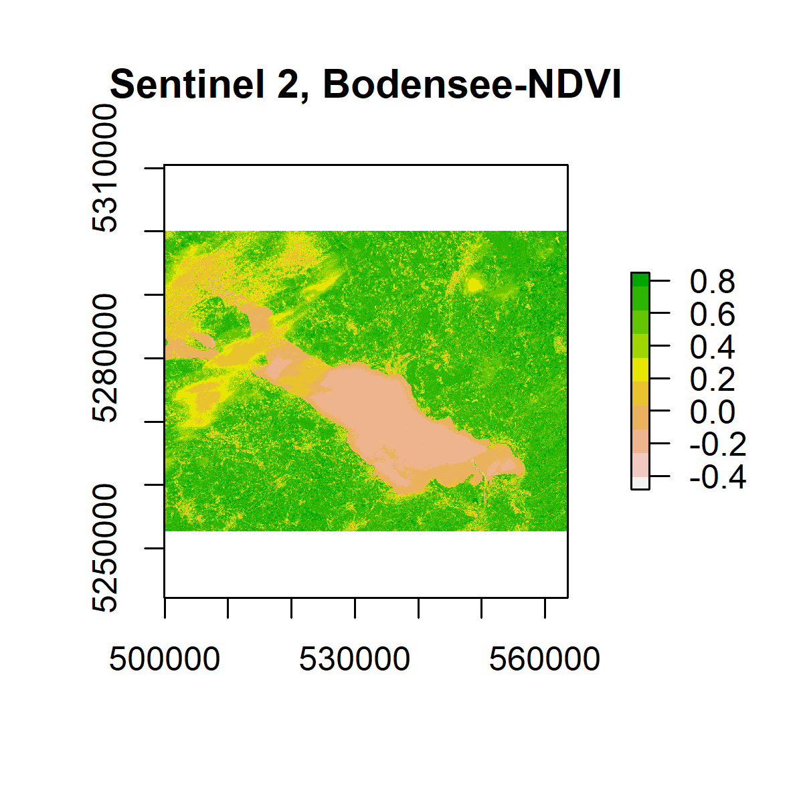
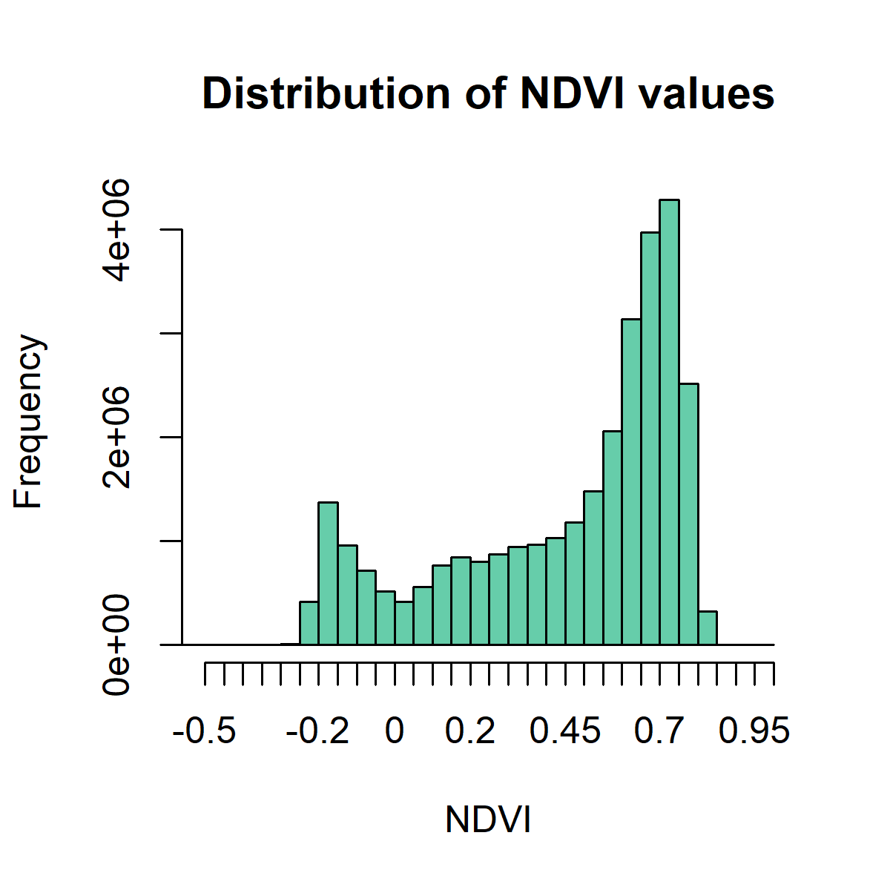
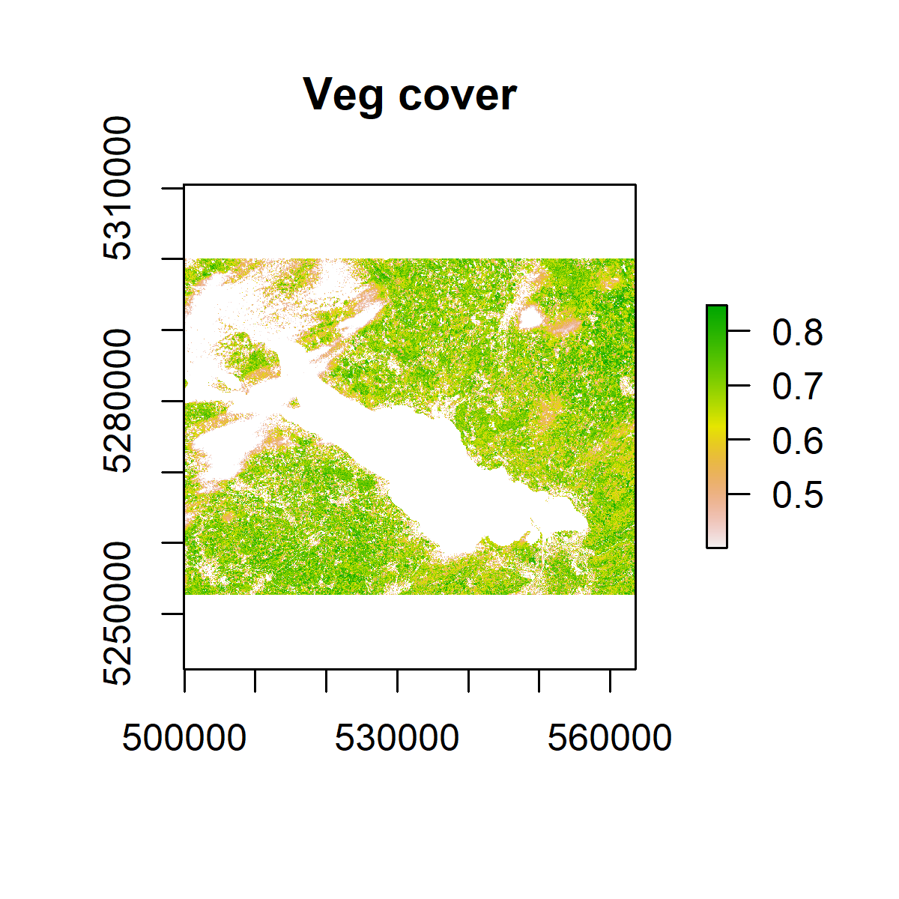
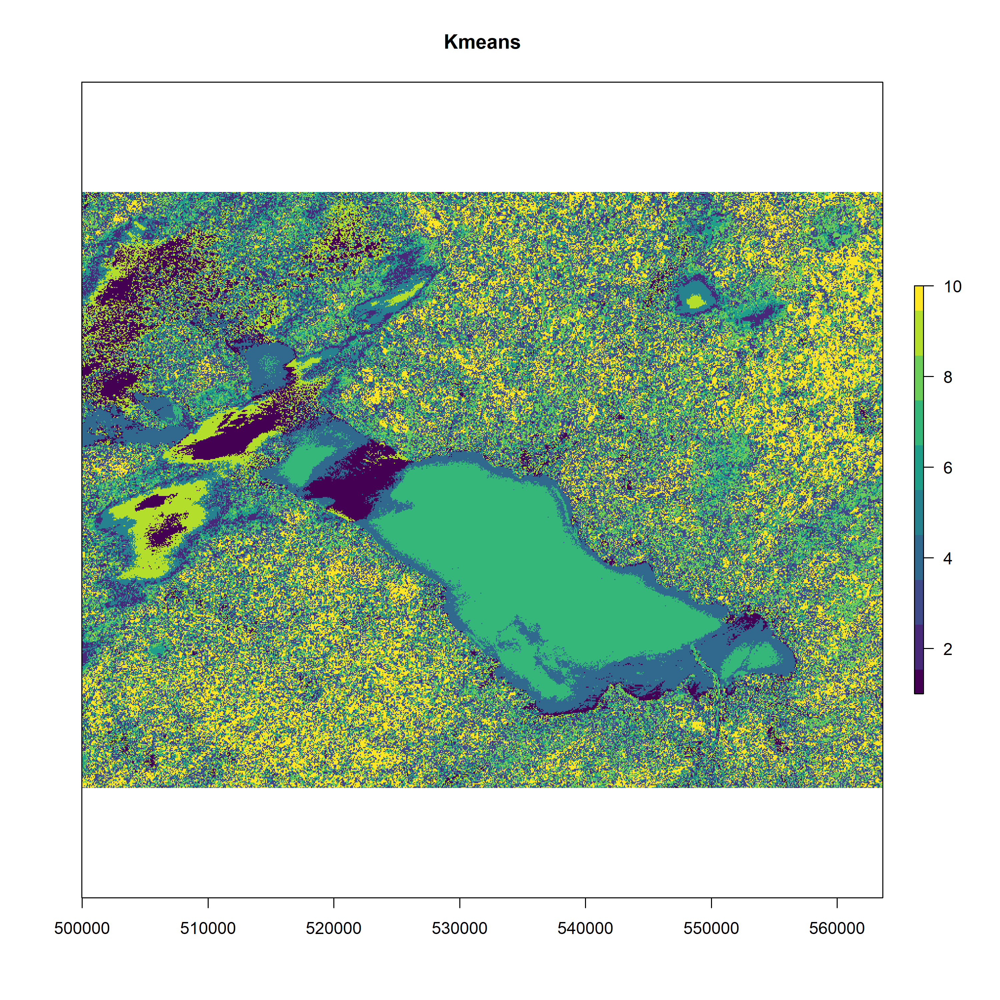

# NDVI-and-K-Mean-Classification-from-Sentinel-2

## Data source: USGS
```
https://earthexplorer.usgs.gov/
```

## Data Set: 
### Sentinel-2 
### Location: Bodensee, Southern Germany
### Date of data: 2020-07-10
### Preprocessed and Export to GeoTIFF by SNAP
### Atmospheric Correction by Sen2Cor

## Load Packages

```
library(sp)
library(rgdal)
library(raster)
library(ggplot2)
library(viridis)
library(rasterVis)
```

# Load Data
```
bodensee <- raster('Bondensee-July-2020.tif')
```

# Get properties of the Bodensee raster
```
bodensee
```

# Create individual raster layers for each of the spectral bands in raster into list()
```
b = list()
nbands(bodensee)

for(i in 1:nbands(bodensee))
{
  b[[i]] <- raster('Bondensee-July-2020.tif', band = i)
}
```

# Comepare two bands to see if they have same extent, nrow, ncol, proj, res, origin.  
```
compareRaster(b[[2]], b[[3]])
```

# Plot
```
plot(b[[9]])
```

# Zoom to the click
```
zoom(b[[9]])
```

# Crop raster
```
e <- drawExtent()
# e <- extent(c(, , , ,))
cropped_bodensee <- crop(b[[9]],e)
plot(cropped_bodensee)
image(cropped_bodensee)
image(cropped_bodensee, col = viridis_pal(option = "D")(10), main = "Sentinel 2 image of Bodensee")
```

## Export Plot
```
png('cropped-bodensee-B9', width = 5, height = 5, units = "in", res = 300)
image(cropped_bodensee, col = viridis_pal(option = "D")(10), main = "Sentinel 2 image of Bodensee")
dev.off()
```

## Create Raster Stack
```
bodenseeRGB = stack(list(b[[4]], b[[3]], b[[2]]))
plot(bodenseeRGB)
plotRGB(bodenseeRGB, axes = TRUE, stretch = "lin", main = "Sentinel RGB colour composite")
```

## Export RGB plot
```
png('RGB.png', width = 5, height = 4, units = "in", res = 300)
plotRGB(bodenseeRGB, axes = TRUE, stretch = "lin", main = "Sentinel RGB colour composite")
dev.off()
```
<!-- -->

## Plot with ggplot2
```
gplot(b[[9]]) +
  geom_raster(aes(x = x, y = y, fill = value)) +
  # value is the specific value (of reflectance) each pixel is associated with
  scale_fill_viridis_c() +
  coord_quickmap() +
  ggtitle("Bodensee, raster plot") +
  xlab("Longitude") +
  ylab("Latitude") +
  theme_classic() +   					                    # removes defalut grey background
  theme(plot.title = element_text(hjust = 0.5),     # centres plot title
        text = element_text(size=20),		       	    # font size
        axis.text.x = element_text(angle = 90, hjust = 1))  # rotates x axis text

ggsave("ggBodensee.png", scale = 1.5, dpi = 300) 		    # to save plot
```
<!-- -->

## Facet Plots with ggplot2
### Create Stack
```
bodenseeStack = stack(list(b[[1]], b[[2]], b[[3]], b[[4]], b[[5]], b[[6]], b[[7]], b[[8]], b[[10]], b[[11]], b[[12]], b[[13]]))
```

### Facetted Plot
```
gplot(bodenseeStack) +
  geom_raster(aes(x = x, y = y, fill = value))+
  scale_fill_viridis_c() +
  facet_wrap(~variable) +
  coord_quickmap()+
  ggtitle("Sentinel 2 Bodensee, raster plots") +
  xlab("Longitude") +
  ylab("Latitude") +
  theme_classic() +
  theme(text = element_text(size=20),
        axis.text.x = element_text(angle = 90, hjust = 1)) +
  theme(plot.title = element_text(hjust = 0.5))

ggsave("allbands.png", scale = 1.5, dpi = 300) # to save plot
```
<!-- -->


## Quick visualisation by brick and base plot
```
bodenseeBrick = brick('Bondensee-July-2020.tif')
plot(bodenseeBrick)
```
<!-- -->


# Calculate NDVI
## NDVI Equation:
```
(NIR - Red)/(NIR + Red)
```

### Create a VI funcion (Vegetation index)
```
VI <- function(img, k, i)
{
  bk = img[[k]]
  bi = img[[i]]
  
  vi = (bk - bi) / (bk + bi)
  
  return(vi)
}
```

### For Sentinel 2, the relevant bands to use for NDVI calculation are:
#### NIR = 8, red = 4
```
ndvi = VI(bodenseeBrick, 8, 4)

plot(ndvi, col = rev(terrain.colors(10)), main = 'Sentinel 2, Loch Tay-NDVI')
```

### Export plot
```
png('ndviplot.png', width = 4, height = 4, units = "in", res = 300)
plot(ndvi, col = rev(terrain.colors(10)), main = 'Sentinel 2, Bodensee-NDVI')
dev.off()
```
<!-- -->

### Distribution the pixel NDVI values in Histogram
```
png('ndvihist.png', width = 4, height = 4, units = "in", res = 300)
hist(ndvi,
     main = "Distribution of NDVI values",
     xlab = "NDVI",
     ylab= "Frequency",
     col = "aquamarine3",
     xlim = c(-0.5, 1),
     breaks = 30,
     xaxt = 'n')
axis(side = 1, at = seq(-0.5,1, 0.05), labels = seq(-0.5,1, 0.05))
dev.off()
```
<!-- -->

# Masking or Outlier
## Mask pixels with NDVI value of less than 0.4 (Less likely to be vegetation)
```
veg <- reclassify(ndvi, cbind(-Inf, 0.4, NA))

plot(veg, main = 'Veg cover')
```

### Export plot
```
png('ndvimask.png', width = 4, height = 4, units = "in", res = 300)
plot(veg, main = 'Veg cover')
dev.off()
```
<!-- -->


### Write raster file and Export
```
writeRaster(x = ndvi,
            filename="bodensee-ndvi-2020.tif", 	
            format = "GTiff",
            datatype = 'INT2S') # Save as INTEGER
```

# K mean: Unsupervised Classification

## Convert Raster into array
```
nr = getValues(ndvi)
str(nr)
nr
```

## Set seed - Generates random numbers
```
set.seed(99)
```

## Create 10 clusters, allow 500 iterations, start with 5 random sets using 'Lloyd' method
```
kmncluster <- kmeans(na.omit(nr), centers = 10, iter.max = 500,
                     nstart = 5, algorithm = "Lloyd")
```

### Check class
```
str(kmncluster)

# Large kmeans
# kmncluster: 30151005
```
## To visualise, Convert kmncluster$cluster array back to RasterLayer

### Create copy of ndvi layer
```
knr <- ndvi
```

### Replace raster cell values with kmncluster$cluster
```
knr[] <- kmncluster$cluster
```

# Alternative way
```
values(knr) = kmncluster$cluster
```
```
knr 
# RasterLayer with 30,151,005 cells
# Values 1:10
```
```
par(mfrow = c(1, 2))
plot(ndvi, col = rev(terrain.colors(10)), main = "NDVI")
plot(knr, main = "Kmeans", col = viridis_pal(option = "D")(10))
```

## Export kmean plot
```
png('kmeans.png', width = 10, height = 10, units = "in", res = 300)
plot(knr, main = "Kmeans", yaxt = 'n', col = viridis_pal(option = "D")(10))
dev.off()
```

<!-- -->
<!-- -->
